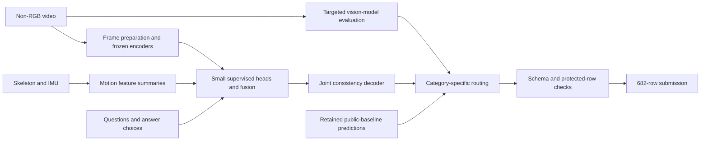

# CUHK-X · Multimodal Action Understanding

**Answering questions about human activity from non-RGB video and motion signals.**

Competition project by [Abhra Dubey](https://github.com/goodcoderind) · Kaggle: [Obro](https://www.kaggle.com/obrodubey)

| Best recorded public score | Public position observed | Submission size |
| --- | --- | --- |
| **0.88304** | **24 / 213 teams** on 15 September 2026 | **682 answers** |

The public leaderboard uses approximately half the test questions. This is a dated public result, not a final private placement. [Competition leaderboard](https://www.kaggle.com/competitions/cuhk-x-competition-large-model-track/leaderboard).

This repository presents the engineering behind the project: frame preprocessing, frozen visual representations, small supervised prediction heads, cross-question consistency, and controlled vision-model experiments. It includes runnable components and a curated experiment report.

The starting point was [Fususu / phuongncn's public prediction baseline](https://www.kaggle.com/code/phuongncn/lb-0-77777-exact-submission-research-handoff), reported at **0.77777**. The best recorded submission reached **0.88304**, a **10.527 percentage-point** difference. Some inherited predictions remain in that submission; this repository does **not** claim to regenerate the complete score from raw data. See [attribution](docs/ATTRIBUTION.md) and [reproducibility](docs/REPRODUCIBILITY.md).

## What the system does

One recording can produce several questions: which action occurs, which set of actions occurs, which bundle is correct, and in what order events happen. Independent answers can contradict each other. The project combines learned evidence with explicit constraints between questions about the same recording.



This diagram summarizes the historical pipeline. The public package contains selected components, rather than every model, weight, or inference service in the diagram.

## Engineering highlights

- **Preserve the input.** Split four-frame contact sheets into individual images and square-pad before encoding, avoiding a center crop that discards most of a wide strip.
- **Use structure in the questions.** Jointly score action sets and related answers instead of treating every letter as an unrelated decision.
- **Evaluate by person.** Keep recordings from a held-out person out of fitting; distinguish reused development checks from genuinely unseen evaluation.
- **Investigate bigger models empirically.** Evaluate frozen V-JEPA 2 representations and targeted Astra vision calls without attributing every experiment to the final gain.
- **Audit failures.** Identify pose-index/actor-order problems, track preprocessing compatibility, and preserve failed-gate results even when a later exploratory submission improves the public score.

## Run the offline example

Python 3.10+; no dataset, model download, API key, or accelerator required.

```bash
git clone https://github.com/goodcoderind/cuhk-x-multimodal-reasoning.git
cd cuhk-x-multimodal-reasoning
PYTHONPATH=src python -m cuhkx_portfolio.demo
PYTHONPATH=src python -m unittest discover -s tests -v
```

The example uses **invented questions and scores** to demonstrate constrained decoding, grouped validation, and option-permutation handling. Its output is not a competition prediction or an accuracy benchmark. [Code provenance and module guide](docs/CODE_MAP.md).

An optional [frame-encoding example](research/README.md) preserves the historical preprocessing idea and uses a user-supplied local OpenCLIP checkpoint.

## Read the project

| Document | What it explains |
| --- | --- |
| [Methodology](docs/METHODOLOGY.md) | Inputs, models, supervision, decoding, and routing |
| [Results and experiments](docs/RESULTS.md) | Verified score milestones, negative results, and their limits |
| [Reproducibility](docs/REPRODUCIBILITY.md) | What runs here and what the complete submission still requires |
| [Code map](docs/CODE_MAP.md) | Historical implementations versus newly packaged examples |
| [Attribution](docs/ATTRIBUTION.md) | Public baseline, pretrained models, and AI-assisted development |
| [Interview guide](docs/INTERVIEW_GUIDE.md) | A concise explanation and technical questions to prepare for |

## Scope and credit

This was an **AI-assisted competition project**: implementation, experiment orchestration, debugging, and documentation used Codex/Astra assistance. It is not a claim of sole manual authorship or of training a foundation model. V-JEPA 2 was used as a frozen pretrained encoder, not for robot planning or future-state rollouts.

No competition images, sensor recordings, answer keys, prediction CSVs, model weights, or private provider logs are distributed here. Obtain any permitted data from the organizers and follow its separate license. The original code in this release is MIT-licensed; that license does not grant rights to third-party data, weights, or baseline outputs.
